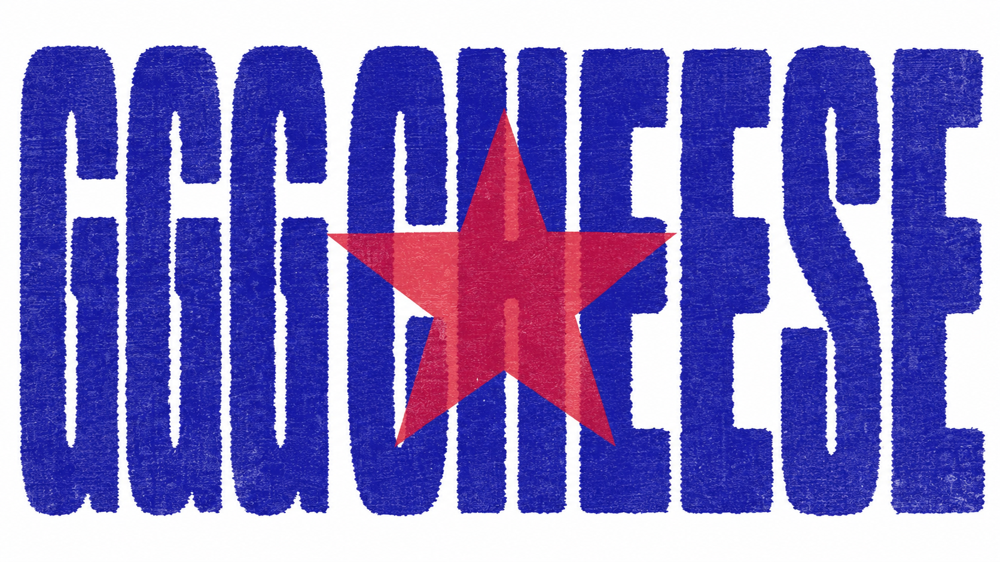
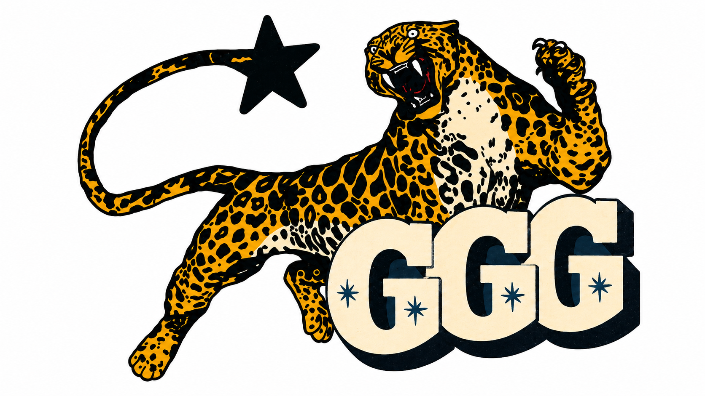

  

  
## About

I am **GGG Chang**, a computer science student from **Wuhan University**.

I believe that coding is a tpye of ART,and I wanna be an ARTIST.

By the way, I am seeking for job opportunities(both intern & full-time are acceptable).

  

  
## Album Today

  Anybody does somethin' that much and that long and is that good, it's gotta pay off  --Knaye.

  

## 🧰 Tool Box

  Tools set the language. Projects reveal the taste.

 

<table align="center">
  <tr>
    <td align="center" width="50%">
      <strong>🧩 Languages</strong>
        
      
      
      
       
      
      
      
    </td>
    <td align="center" width="50%">
      <strong>🎨 Frontend / Client</strong>
        
      
      
       
      
      
    </td>
  </tr>

  <tr>
    <td align="center" width="50%">
      <strong>🗄️ Database</strong>
        
      
      
       
      
    </td>
    <td align="center" width="50%">
      <strong>🤖 AI Agent / Coding Tools</strong>
        
      
      
       
      
    </td>
  </tr>

  <tr>
    <td align="center" colspan="2">
      <strong>⚙️ Tools & Platform</strong>
        
      
      
      
    </td>
  </tr>
</table>

  Portfolio

  Product-minded frontend, agent interaction, and systems work shaped with care.

<table>
  <tr>
    <td width="50%" valign="top">
      AI FITNESS AGENT
      <h3><a href="https://github.com/gggchang4/GymPal">GymPal</a></h3>
      
A conversational fitness product that brings training plans, nutrition, recovery, and daily guidance into one agent-centered experience.

      
<strong>Stack</strong> Next.js 14 · TypeScript · NestJS · FastAPI · Prisma · PostgreSQL · OpenAI-compatible runtime

      
<strong>Role</strong> Frontend engineer + agent engineer

    </td>
    <td width="50%" valign="top">
      DOCUMENTATION AS PRODUCT
      <h3><a href="https://github.com/gggchang4/Git-Tutorial">Git Tutorial</a></h3>
      
A documentation-first Git project that turns scattered commands and habits into one coherent learning system, reference manual, and workflow guide.

      
<strong>Stack</strong> Markdown · Git · GitHub · SVG assets · documentation system design

      
<strong>Role</strong> Designed and built solo

    </td>
  </tr>
  <tr>
    <td width="50%" valign="top">
      DATABASE SYSTEM
      <h3><a href="https://github.com/gggchang4/WHU-CSLab-DB-Genealogy">WHU-CSLab-DB-Genealogy</a></h3>
      
A genealogy management system built around recursive lineage queries, large synthetic datasets, and query-performance analysis for database coursework.

      
<strong>Stack</strong> PostgreSQL · SQL · Recursive CTE · Python · data generation scripts · EXPLAIN analysis · web demo prototype

      
<strong>Role</strong> Designed and built solo

    </td>
    <td width="50%" valign="top">
      RELATIONSHIP AGENT
      <h3><a href="http://8.148.72.200">LoveMediator</a></h3>
      
A private relationship-support agent for couples, shaped around emotional regulation, guided reflection, and calmer conflict resolution.

      
<strong>Stack</strong> React · TypeScript · Python · FastAPI · PostgreSQL

      
<strong>Role</strong> Frontend engineer + agent engineer

    </td>
  </tr>
</table>

## Profile Views

  

## Star History

<a href="https://www.star-history.com/?repos=gggchang4%2Fgggchang4&type=timeline&logscale=&legend=top-left">
 <picture>
   <source media="(prefers-color-scheme: dark)" srcset="https://api.star-history.com/image?repos=gggchang4/gggchang4&type=timeline&theme=dark&logscale&legend=top-left" />
   <source media="(prefers-color-scheme: light)" srcset="https://api.star-history.com/image?repos=gggchang4/gggchang4&type=timeline&logscale&legend=top-left" />
   
 </picture>
</a>

## Visitors from the globe

  
  

  
<pre>
███████╗   ██████╗   ██████╗
██╔════╝  ██╔════╝  ██╔════╝
██║  ███╗ ██║  ███╗ ██║  ███╗
██║   ██║ ██║   ██║ ██║   ██║
╚██████╔╝ ╚██████╔╝ ╚██████╔╝
 ╚═════╝   ╚═════╝   ╚═════╝
</pre>

  

  

