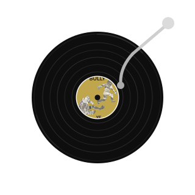

  

## About

I am **GGG Chang**, a computer science student from **Wuhan University of Science and Technology**.

I believe that coding is a tpye of ART,and I wanna be an ARTIST.

## Tool Box
| Property                                        | Data |
|-------------------------------------------------|------|
| **Language / IDE**                              |       |
| **Frontend / Client**                           |     |
| **Databases**                                   |    |
| **AI Agent / Coding Tools**                     |    |
| **Tools & Platform**                            |    |

## Profile Views

  

## Star History

<a href="https://www.star-history.com/?repos=gggchang4%2Fgggchang4&type=timeline&logscale=&legend=top-left">
 <picture>
   <source media="(prefers-color-scheme: dark)" srcset="https://api.star-history.com/image?repos=gggchang4/gggchang4&type=timeline&theme=dark&logscale&legend=top-left" />
   <source media="(prefers-color-scheme: light)" srcset="https://api.star-history.com/image?repos=gggchang4/gggchang4&type=timeline&logscale&legend=top-left" />
   
 </picture>
</a>

## Album Today

  Anybody does somethin' that much and that long and is that good, it's gotta pay off  --Knaye.

  

  
<pre>
███████╗  ██████╗   ██████╗
██╔════╝ ██╔════╝  ██╔════╝
██║  ███╗██║  ███╗ ██║  ███╗
██║   ██║██║   ██║ ██║   ██║
╚██████╔╝╚██████╔╝ ╚██████╔╝
 ╚═════╝  ╚═════╝   ╚═════╝
</pre>

